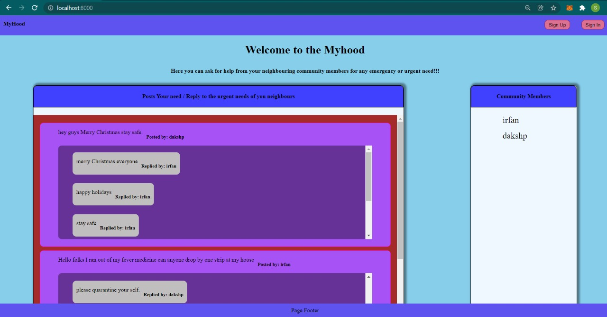

# myHood

**Team Members 👨🏻‍💻:**

1. [Abuzar Bagewadi](https://github.com/abuzarbagewadi)​ 19BCE0773​

2. [Daksh Paleria](https://github.com/dakshp07)​ 19BCE0779​

3. [Shaik MD Irfan Nawaz](https://github.com/Irfan-vit)​ 19BCE0780​

4. [Neelesh Sharma](https://github.com/Neelesh2512)​ 19BCE0768​

**Abstract ✅:**

Due to the pandemic everyone is restricted to their homes and unable to socialize with their surrounding people and neighbours and unable get any updates about the situation around them. Our platform ‘Welcome to Neighbourhood’ tries to tackle this problem by developing a full-fledged social media web application which can help the users create their own profiles, make new post and moreover it allows the user to connect, chat, share with each other among their neighbourhood.

**Problem Statement 🆕:**

Present social media applications are very vast and the connections are widespread in way this is a good thing as we can broaden our reach, but due to the ongoing pandemic situation we are mostly confined to our homes we can’t even go to our neighbour’s home and the communication among the community is decreasing. Maintaining a healthy and active relationship with community members is very important as they are very near to us and mostly know about the surroundings better than anyone else outside the community, they will be swift and first persons to provide any aid or assistance in emergency situations. If we post something on today’s social media it will be difficult to reach our nearest people due to worldwide presence and also the information which is only applicable to community will be useless to post for the whole world and an also there will be privacy concerns.

**Tech Stack 📚:**

- [MongoDB](https://docs.mongodb.com/)
- [Express JS](https://expressjs.com/)
- [Node JS](https://nodejs.org/en/docs/)

**Conclusion 😇:**

A neighbourhood social media website has been successfully created where a user can sign in and write posts mainly focused on asking for help in the form of assistance, bringing medicines/drugs, general information about the ongoing situation which could be helpful to all the community members who choose to use this website. 

The present situation has forced us all to social isolation and it has become more and more important to help each other as a critical situation can arise at any given moment. But traditional social media apps present a disadvantage as they are hubs of fake news and propaganda, which takes away focus from our main objective here, which is to help each other in teams like these.

Our website allows members to interact with each other and try to aid the person in need without any intermediary or distractions like ads, popups or promotions. This will mean that people who want help and want to help will be accessible to each other in the lowest possible delay and this will eventually lead to lesser worsening of their existing health condition. As a whole it is also building a sense of responsibility and community with one another, which was seemingly fading away to in ongoing pandemic.
